## Menu

 [Thai Food](#thai-food) | [Chinese Food](#chinese-food) | [Korean Food](#korean-food) | [Indian Food](#indian-food) | ...

## Thai Food

| Name                  | Description                                                                                                                                           |                                                      | Price |
|:----------------------|-------------------------------------------------------------------------------------------------------------------------------------------------------|------------------------------------------------------|------:|
| **Tom Yum Goong**     | A spicy and sour Thai soup made with lemongrass, lime leaves, shrimp, and other ingredients, creating a flavorful and aromatic dish.                  |      |   159 |
| **pad Kaprao**        | A stir-fried Thai dish made with holy basil, minced meat, chili peppers, and garlic, resulting in a delicious and well-seasoned stir-fry.             | 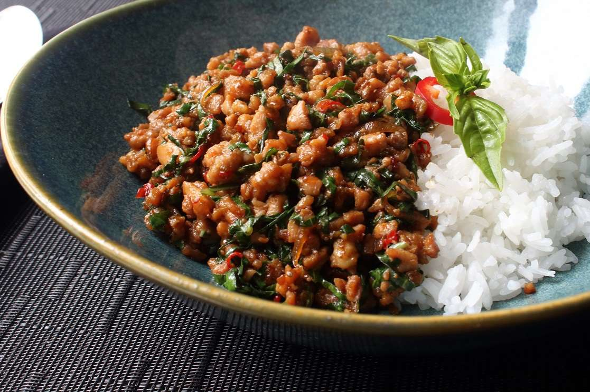        |    59 |
| **Pad Thai**          | A stir-fried rice noodles combined with ingredients like eggs, tofu or shrimp, and a flavorful blend of tamarind, fish sauce, and various seasonings. |           |    79 |
| **Papaya Salad**      | A northeastern region dish made with shredded green papaya mixed with ingredients like tomatoes, chili peppers, garlic, fish sauce, and lime juice.   |       |    59 |
| **Mango Sticky Rice** | A Thai dessert that pairs the sweetness of ripe mango slices with sticky glutinous rice, typically drizzled with a rich and creamy coconut sauce.     | 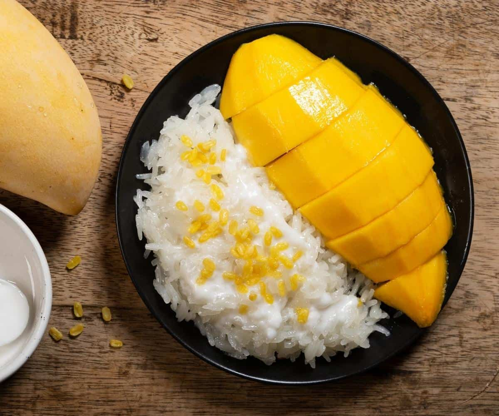 |    69 |

## Chinese Food

| Name                               | Description                                                                                                                                                                                       |                                              | Price |
|:------------------------------------|--------------------------------------------------------------------------------------------------------------------------------------------------------------------------------------------------|----------------------------------------------|------:|
| **Soup Dumplings (Xiao Long Bao)** | Dumplings with the soup inside.                                                                                                                                                                   | 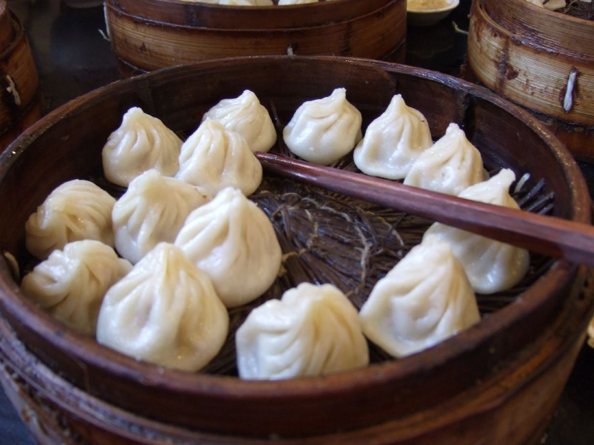     |   110 |
| **Spring Rolls**                   | Dim sum stuffed with vegetables or meat and wrapped in thin dough wrappers.                                                                                                                       | 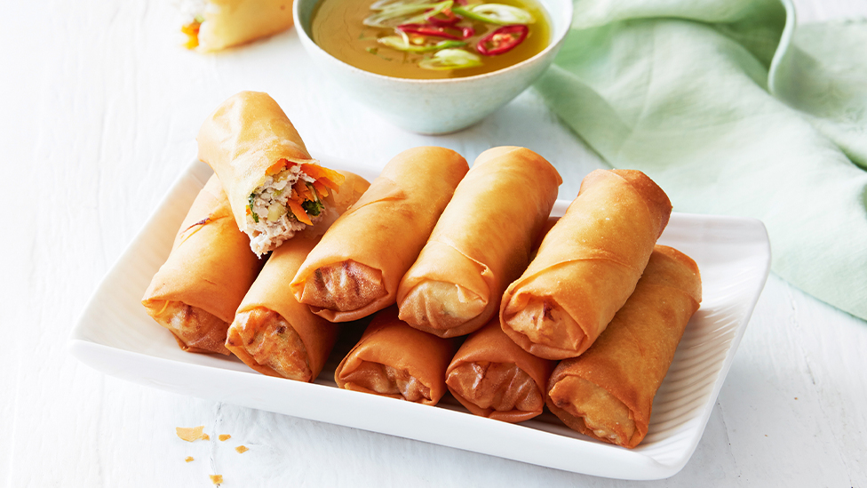  |   100 |
| **Peking Roasted Duck**            | Marinated duck with crispy skin, served with thin pancakes, scallions, cucumber, and hoisin sauce.                                                                                                |      |   700 |
| **Sichuan Pork**                   | Pork, with a coating made from egg-white and starch to preserve its freshness and tenderness, is boiled in broth. The meaty broth is typical Sichuan cuisine, featuring a peppery and spicy taste | 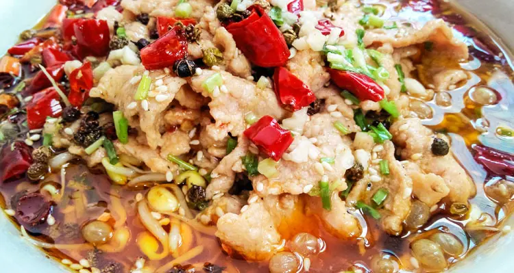     |   200 |
| **Zhajiangmian**                   | Thick wheat noodle dish topped with zhajiang sauce.                                                                                                                                               |  |   150 |

## Korean Food 

| Name                     | Description                                                                                                                                                                                                                  |                                                          | Price |
|:-------------------------|------------------------------------------------------------------------------------------------------------------------------------------------------------------------------------------------------------------------------|----------------------------------------------------------|------:|
| **Kimchi**               | Kimchi is a traditional Korean fermented dish made from vegetables, primarily napa cabbage, seasoned with a mixture of spices and seasonings, resulting in a flavorful and tangy condiment.                                  |                |    30 |
| **Bibimbap**             | Bibimbap is a Korean dish consisting of a vibrant assortment of sauteed vegetables, meat, or tofu, served over a bed of rice and often topped with a fried egg, and mixed together with spicy gochujang sauce before eating. |              |   120 |
| **Tteokbokki**           | Tteokbokki is a popular Korean street food made from chewy rice cakes cooked in a spicy and savory gochujang sauce, offering a delightful blend of flavors and textures.                                                     | 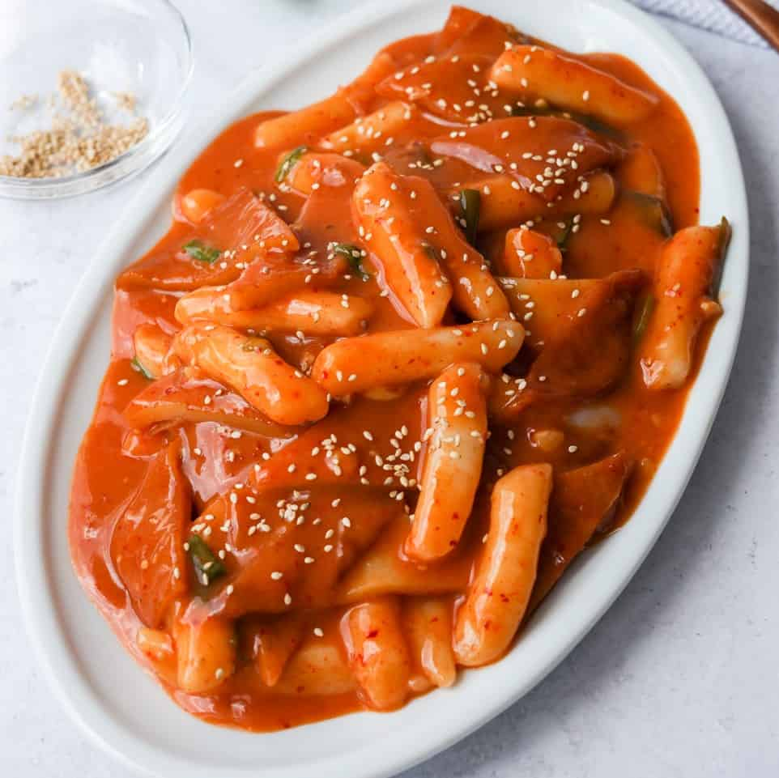           |   120 |
| **Bulgogi**              | Bulgogi is a beloved Korean dish of thinly sliced marinated beef, typically grilled or pan-fried, known for its tender texture and sweet-savory flavors.                                                                     | 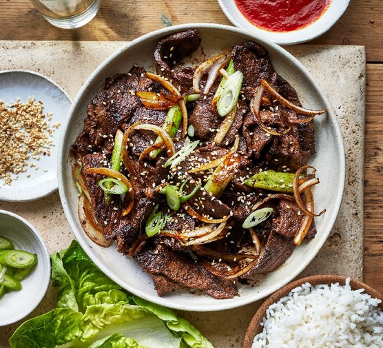              |   150 |
| **Korean Fried Chicken** | Korean fried chicken is a crispy and flavorful dish with a distinct double-frying process, often coated in a variety of sauces ranging from sweet and spicy to tangy and savory.                                             |  |   100 |

## Indian Food

| Name                     | Description                                                                                                      |                                                          | Price   |
|:-------------------------|------------------------------------------------------------------------------------------------------------------|----------------------------------------------------------|--------:|
| **Butter Chicken**       | Conjures a creamy, spiced global taste of Northern India.!                                                       | 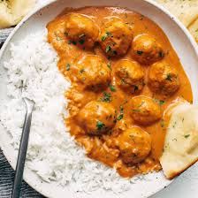        |     220 |
| **Tandoori Chicken**     | Punjab's culinary gem, visually appetizing, smoky-grilled delight symbolizing North Indian spice allure.         |         |     250 |
| **Chicken Tikka Masala** | British multicultural symbol, Indian soul; tender tikka in creamy, spiced tomato medley, universally cherished.  | 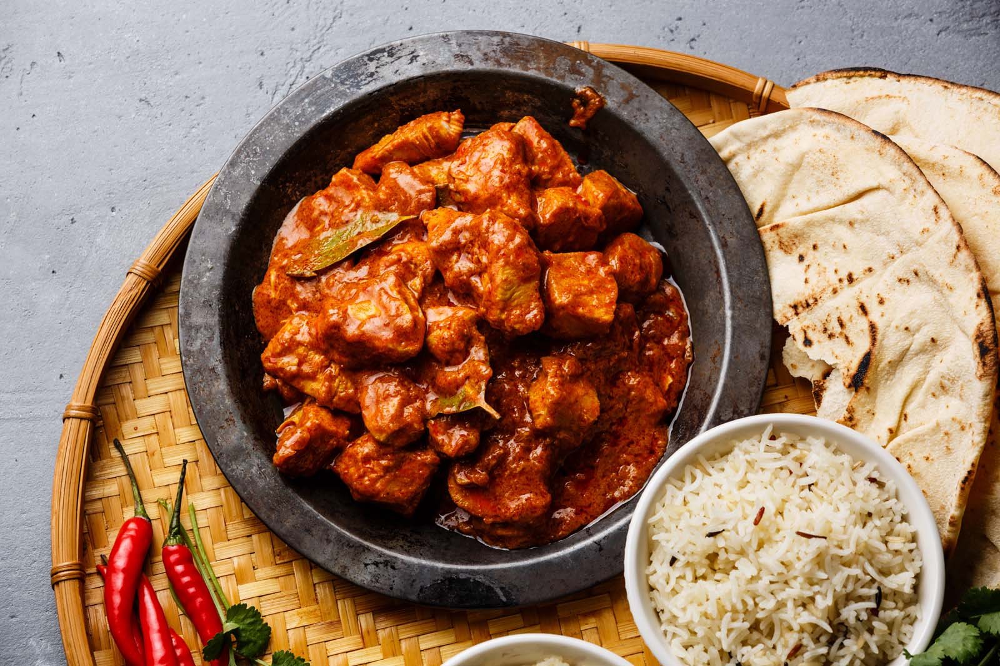        |     290 |
| **Rogan Josh**           | 'Red heat' in translation, slow-cooked meat in spiced Kashmiri red chili gravy, exuding warmth and color.        | 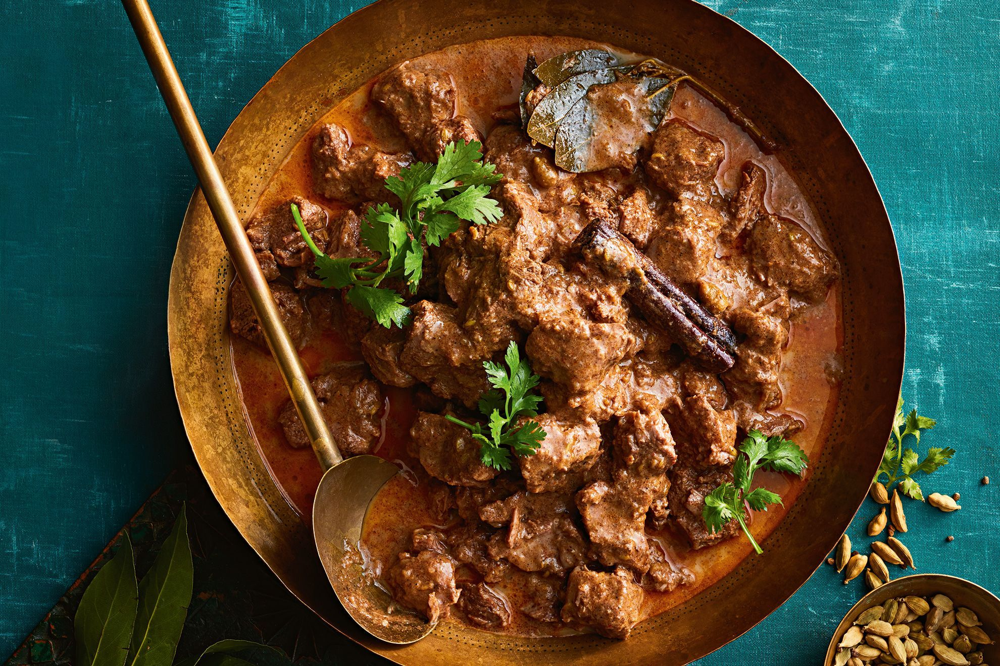        |     330 |
| **Korma**                | Royal Mughal legacy, creamy aromatic curry with roots in 'to braise,' offering chicken, lamb, or paneer options. | 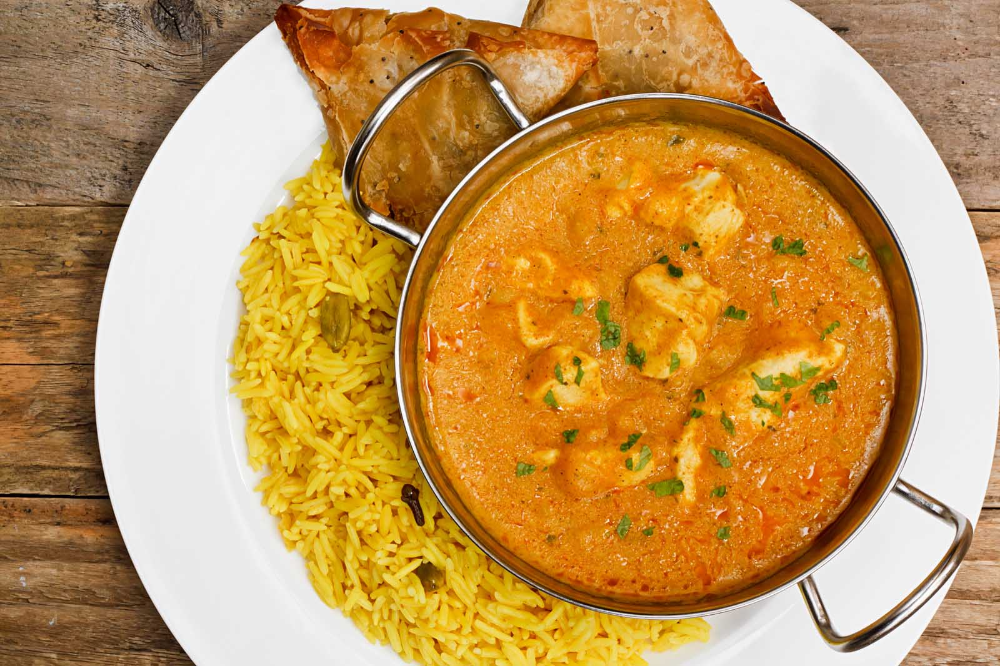        |     270 |
