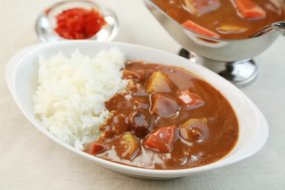
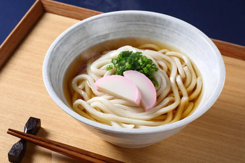
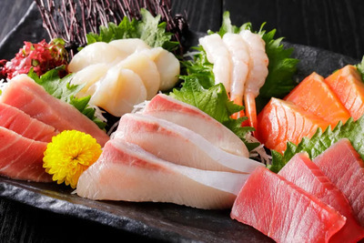

## Menu
 [Japanese Food](#japanese-food)

## Japanese Food

| Name           | Description                                                                             |                                    | Price |
|:---------------|-----------------------------------------------------------------------------------------|------------------------------------|------:|
| **Yakiniku**   | Grilled and marinated slices of meat, served for tableside grilling.                    |  |   330 |
| **Curry rice** | A comforting dish of Japanese curry with meat and vegetables, served over steamed rice. |     |   270 |
| **Tonkatsu**   | Deep-fried, breaded pork cutlet with a crispy exterior and tender interior.             |  |   180 |
| **Udon**       | Thick wheat noodles in a savory broth with toppings.                                    |      |   180 |
| **Sashimi**    | Fresh, thinly sliced raw seafood, showcasing natural flavors and textures.              |   |   300 |

