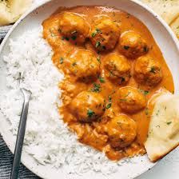
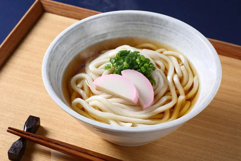
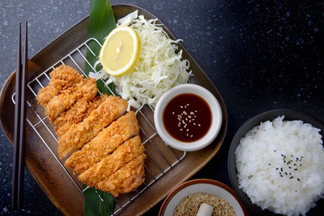
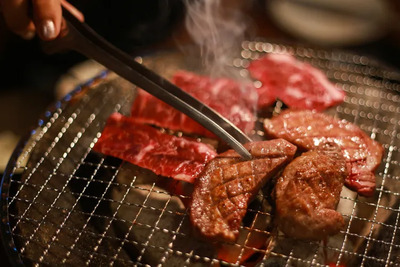

## Menu

[indian Food](#indian-food) | ...

## indian Food

| Name                     | Description                                                                                                       |                                            | Price   |
|:-------------------------|-------------------------------------------------------------------------------------------------------------------|--------------------------------------------|--------:|
| **Butter Chicken**       | conjures a creamy, spiced global taste of Northern India.!                                                        |  |     220 |
| **Tandoori Chicken**     | Punjab's culinary gem, visually appetizing, smoky-grilled delight symbolizing North Indian spice allure.          |  |     250 |
| **Chicken Tikka Masala** | British multicultural symbol, Indian soul; tender tikka in creamy, spiced tomato medley, universally cherished.   |  |     290 |
| **Rogan Josh**           | 'red heat' in translation, slow-cooked meat in spiced Kashmiri red chili gravy, exuding warmth and color.         |  |     330 |
| **Korma**                | Royal Mughal legacy, creamy aromatic curry with roots in 'to braise,' offering chicken, lamb, or paneer options.  |  |     270 |

