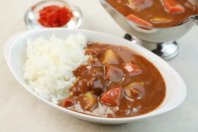
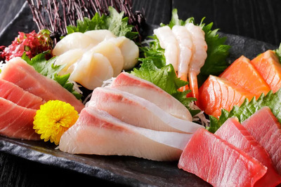
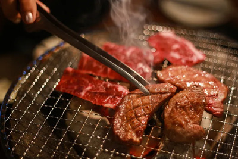

## Menu
 [Japanese Food](#japanese-food)

## Japanese Food

| Name           | Description                                                                             |                                                             | Price |
|:---------------|-----------------------------------------------------------------------------------------|-------------------------------------------------------------|------:|
| **Yakiniku**   | Grilled and marinated slices of meat served for table side grilling.                    |               |   330 |
| **Curry Rice** | A comforting dish of Japanese curry with meat and vegetables, served over steamed rice. |               |   270 |
| **Tonkatsu**   | Deep-fried, breaded pork cutlet with a crispy exterior and tender interior.             |                |   180 |
| **Udon**       | Thick wheat noodles in a savory broth with toppings on.                                 |  |   180 |
| **Sashimi**    | Fresh, thinly sliced raw seafood, showcasing natural flavors and textures.              |                |   300 |

